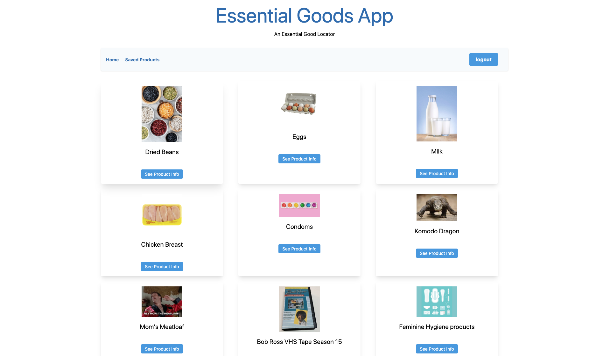

# Essential Goods Locator 


## Description

As we are all going to unprecedented times, we undoubtedly
have gone to a store looking for a certain item only to find the shelves bare
and item nowhere to be found. Our app would take the guesswork out of
the store scavenger hunt.

## Technologies

- [Node.js](https://nodejs.org/en/) 
- [Express](https://expressjs.com/) 
- [MySQL](https://www.mysql.com/) 
- [Handlebars](http://handlebarsjs.com/) 
- [Tailwindcss](https://tailwindcss.com/)  
- [jQuery](https://jquery.com/)
- [Sequelize](https://sequelize.org/)
- [Bootstrap](https://getbootstrap.com/)

## Usage and Installation

Feel free to clone or fork this repo if you find it useful. To install dependencies make sure to run:

```
npm i
```

You will also need to install [MySql Workbench](https://www.mysql.com/products/workbench/) or some other application that handles SQL databases. Before spinning up the server use the schema.sql to build up the database with MySql Workbench.

If everything is ok you should be able to see this app running locally in your browser at localhost:8080. 

## Demo

Demo is still in progress...

## Contributing

-Kevin Cox(Co-Creator) - kevincox1983@gmail.com
-Chris Ducharme(Co-Creator) - ducharme.christophert@gmail.com
-Chad Worthan(Co-Creator) - chadwworthan@gmail.com

If you wish to contribute to this project please do a pull request. That be super cool.

## Questions?


Have any questions? Want to collaborate on a project? Shoot one of us an email)
